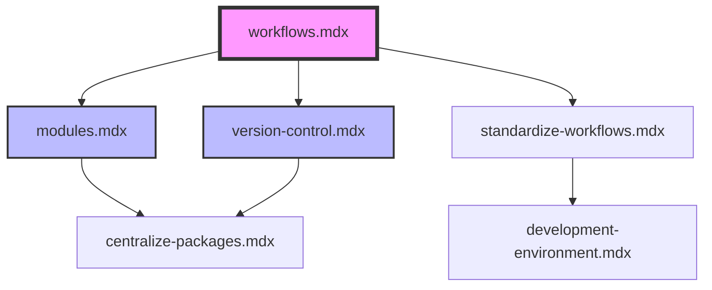

# Cross-Reference Skill

Visualizes document relationships, identifies orphaned documents, and suggests missing connections to improve navigation and discoverability.

## Usage

```bash
/cross-reference <file-paths> [options]
```

## Arguments

- **file-paths**: One or more `.mdx` files to analyze (required)
  - Single file: `/cross-reference docs/modules.mdx`
  - Multiple files: `/cross-reference docs/file1.mdx docs/file2.mdx`
  - Section: `/cross-reference docs/define/**/*.mdx`
  - All docs: `/cross-reference docs/**/*.mdx`

- **--orphans** or **-o**: Show only orphaned documents (optional)
  - Documents with no incoming links
  - Example: `/cross-reference docs/**/*.mdx --orphans`

- **--suggest** or **-s**: Suggest new cross-reference opportunities (optional)
  - Analyzes content similarity
  - Recommends logical connections
  - Example: `/cross-reference docs/modules.mdx --suggest`

- **--format** or **-f**: Output format (optional)
  - Values: `text`, `ascii`, `json`, `mermaid`
  - Default: `text`
  - Example: `--format mermaid`

- **--depth**: Analysis depth for suggestions (optional)
  - Values: `1` (direct connections only), `2` (include indirect), `3` (full graph)
  - Default: 2
  - Example: `--depth 3`

## What This Skill Does

This skill maps document relationships and helps improve navigation through strategic cross-referencing.

### Analysis Process

1. **Link Extraction**
   - Scans all specified documents
   - Extracts internal links between docs
   - Maps bidirectional relationships
   - Identifies link context (where and why linked)

2. **Relationship Mapping**
   - Creates document graph structure
   - Calculates incoming/outgoing link counts
   - Identifies hub documents (highly connected)
   - Finds isolated or orphaned documents

3. **Orphan Detection**
   - Documents with zero incoming links
   - Recently created but not integrated
   - Important docs not discoverable
   - Documents needing more visibility

4. **Suggestion Generation**
   - Analyzes content similarity (keywords, topics)
   - Identifies logical workflow progressions
   - Recommends prerequisite links
   - Suggests follow-up reading

5. **Validation**
   - Checks for workflow consistency
   - Validates progressive complexity
   - Ensures bidirectional linking where appropriate
   - Identifies circular dependencies

## Examples

### Map section relationships
```bash
/cross-reference docs/define/**/*.mdx
```
Shows all connections within the "define" section.

### Find orphaned documents
```bash
/cross-reference docs/**/*.mdx --orphans
```
Lists documents with no incoming links.

### Suggest connections for a document
```bash
/cross-reference docs/modules.mdx --suggest
```
Recommends documents that should link to/from modules.mdx.

### Generate visual diagram
```bash
/cross-reference docs/define/*.mdx --format mermaid
```
Creates Mermaid diagram for visualization.

### Deep analysis with suggestions
```bash
/cross-reference docs/**/*.mdx --suggest --depth 3
```
Comprehensive analysis with indirect connection suggestions.

### Export as JSON
```bash
/cross-reference docs/**/*.mdx --format json > /tmp/doc-graph.json
```
Exports relationship data for external tools.

## Output Format

### Text Format (Default)

```
Document Relationship Map
=========================

Analysis: 15 documents, 42 connections

High-Traffic Documents (5+ incoming links)
==========================================

workflows.mdx (8 incoming, 6 outgoing)
  ← Referenced by:
    - standardize-workflows.mdx (line 23)
    - version-control.mdx (line 45)
    - modules.mdx (line 67, 89)
    - development-environment.mdx (line 34)
    - centralize-packages.mdx (line 56)
  → References:
    - modules.mdx (line 78)
    - version-control.mdx (line 92)
    - as-code/index.mdx (line 45)

modules.mdx (6 incoming, 4 outgoing)
  ← Referenced by:
    - workflows.mdx (line 78)
    - centralize-packages.mdx (line 34)
    - development-environment.mdx (line 56)
  → References:
    - version-control.mdx (line 45)
    - workflows.mdx (line 67)

---

Moderate Connection Documents (2-4 links)
==========================================

version-control.mdx (3 incoming, 3 outgoing)
standardize-workflows.mdx (2 incoming, 4 outgoing)
development-environment.mdx (2 incoming, 2 outgoing)

---

Orphaned Documents (0 incoming links)
======================================

⚠️ artifact-management.mdx
   Has 3 outgoing links but nothing links to it
   💡 Suggestion: Should be referenced from:
      - centralize-packages.mdx (related to package distribution)
      - workflows.mdx (part of CI/CD workflow)

⚠️ as-code/vcs-configuration.mdx
   Has 1 outgoing link but nothing links to it
   💡 Suggestion: Should be referenced from:
      - version-control.mdx (VCS-specific configuration)
      - as-code/index.mdx (section overview should link)

---

Under-Connected Documents (1 incoming link)
============================================

⚠️ centralize-packages.mdx
   Only linked from workflows.mdx
   💡 Could also be referenced from:
      - modules.mdx (package distribution for modules)
      - artifact-management.mdx (package storage)

---

Workflow Progression Analysis
==============================

✅ Clear progression:
   development-environment → version-control → workflows → modules

⚠️ Missing connection:
   standardize-workflows should link to development-environment
   (workflows need standardized dev environments)

❌ Circular reference:
   workflows ↔ modules ↔ workflows
   Consider unidirectional flow for clarity
```

### ASCII Diagram Format

```
                      workflows.mdx
                           |
          +----------------+----------------+
          |                |                |
          v                v                v
    modules.mdx  version-control.mdx  standardize-workflows.mdx
          |                |                |
          +-------+--------+                |
                  |                         |
                  v                         v
            centralize-packages.mdx  development-environment.mdx
```

### Mermaid Diagram Format



### JSON Format

```json
{
  "documents": [
    {
      "path": "docs/workflows.mdx",
      "title": "Workflows",
      "incoming": 8,
      "outgoing": 6,
      "references_from": [
        {
          "document": "docs/modules.mdx",
          "line": 67,
          "context": "workflow automation"
        }
      ],
      "references_to": [
        {
          "document": "docs/modules.mdx",
          "line": 78,
          "context": "module integration"
        }
      ]
    }
  ],
  "orphans": ["docs/artifact-management.mdx"],
  "suggestions": [
    {
      "from": "docs/centralize-packages.mdx",
      "to": "docs/artifact-management.mdx",
      "reason": "Content similarity: package distribution",
      "confidence": 0.85
    }
  ]
}
```

## Suggestion Algorithm

The skill suggests connections based on:

**Content Similarity**
- Keyword overlap (Terraform, modules, workflows, etc.)
- Topic clustering (version control documents should link)
- Code example similarity

**Workflow Logic**
- Sequential steps (A → B → C)
- Prerequisites (must complete A before B)
- Related alternatives (either A or B)

**Documentation Patterns**
- Overview → Detailed docs
- Concept → Implementation
- Problem → Solution

**User Navigation**
- Logical next steps
- Related topics
- Deep dives on mentioned concepts

## Best Practices

**Section-wide analysis:**
```bash
# Analyze entire section
/cross-reference docs/define/**/*.mdx --format text

# Identify orphans
/cross-reference docs/define/**/*.mdx --orphans

# Fix by adding links
# (manual editing)

# Verify improvements
/cross-reference docs/define/**/*.mdx
```

**New document integration:**
```bash
# After creating new doc
/cross-reference docs/new-doc.mdx --suggest

# Implement suggested connections
# (add links in both directions)

# Verify no longer orphaned
/cross-reference docs/**/*.mdx --orphans
```

**Periodic maintenance:**
```bash
# Monthly relationship audit
/cross-reference docs/**/*.mdx --orphans --suggest
```

## Integration with Other Skills

**With /fix-links:**
```bash
# 1. Map relationships
/cross-reference docs/**/*.mdx

# 2. Fix broken links
/fix-links docs/**/*.mdx --fix

# 3. Verify relationships intact
/cross-reference docs/**/*.mdx
```

**With /add-resources:**
```bash
# 1. Find orphaned docs
/cross-reference docs/**/*.mdx --orphans

# 2. Add internal cross-references
# (manual linking)

# 3. Enhance with external resources
/add-resources docs/orphan.mdx --add
```

**With /review:**
```bash
# 1. Check relationships
/cross-reference docs/section/*.mdx

# 2. Review individual docs
/review docs/section/*.mdx --phases 3

# 3. Implement cross-reference improvements
```

## Relationship Patterns

### Hub Document Pattern
```
           workflows.mdx (hub)
                 |
     +-----------+-----------+
     |           |           |
modules.mdx  version-control.mdx  standardize-workflows.mdx
```
One central document referenced by many others.

### Sequential Pattern
```
setup → configure → deploy → monitor
```
Linear progression through workflow.

### Hierarchical Pattern
```
index.mdx (overview)
├── topic-a.mdx
├── topic-b.mdx
└── topic-c.mdx
```
Section overview links to detailed topics.

### Mesh Pattern
```
     A ←→ B
     ↕     ↕
     C ←→ D
```
Highly interconnected related topics.

## Common Issues

**Orphaned documents:**
```
❌ New doc created but not linked from anywhere
✅ Add link from section index or related doc
```

**One-way links:**
```
⚠️ A links to B, but B doesn't link back to A
💡 Consider bidirectional link if both benefit
```

**Over-connected hubs:**
```
⚠️ One document links to 15+ others
💡 Consider creating intermediate grouping docs
```

**Missing workflow progression:**
```
❌ No clear path from beginner to advanced docs
✅ Establish sequential "next steps" links
```

## When to Use This Skill

Use `/cross-reference` when:
- ✅ Adding new documentation (ensure integration)
- ✅ Reorganizing documentation structure
- ✅ Finding discoverability issues
- ✅ Planning documentation architecture
- ✅ Improving user navigation
- ✅ Identifying content gaps
- ✅ Validating workflow progressions

## Reference Files

This skill aligns with:
- **`AGENTS.md`** - Cross-reference patterns
- **`REVIEW_PHASES.md`** - Phase 3 (cross-document relationships)

## Notes

- Analysis respects existing link structure
- Suggestions are recommendations, not requirements
- Some documents intentionally have few connections
- Hub documents are valuable but need maintenance
- Regular cross-reference audits improve navigation
- Works with both `.mdx` and `.md` files
- JSON export enables external visualization tools
